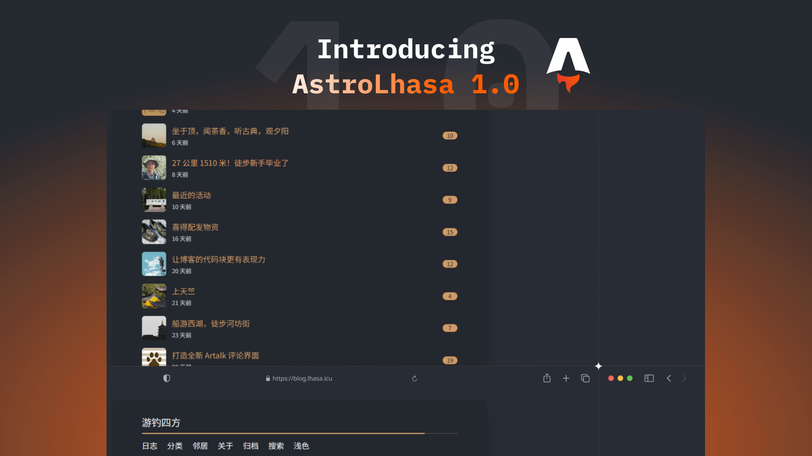

# Astro Lhasa



[](https://996.icu)
[](https://github.com/996icu/996.ICU/blob/master/LICENSE)
[](https://conventionalcommits.org)

Astro Lhasa 是一款简洁、响应式、无障碍友好、并具备良好 SEO 的 Astro 博客主题。

该主题基于 [Astro Paper](https://github.com/satnaing/astro-paper)，并借鉴了好大哥 [Fooleap](https://blog.fooleap.org/) 博客的布局设计

## 特性

- [x] 极快的加载性能
- [x] 内置 SEO 优化
- [x] 多语言支持（i18n）
- [x] 支持 Markdown、Mdx
- [x] 无障碍支持（键盘/旁白）
- [x] 响应式设计（适配手机到桌面）
- [x] 本地模糊搜索
- [x] 草稿文章与置顶
- [x] 自动生成 sitemap 与 RSS
- [x] 超链接将会在新标签页打开
- [x] Expressive Code 代码高亮
- [x] 全站懒加载滚动分页、返回顶部按钮
- [x] GLightbox 图片灯箱
- [x] 图片美化：EXIF 样式、Alt 标签（长条与角标）
- [x] 图片懒加载，且 src 只需要输入文件名，编译时自动补全路径
- [x] 基于时间的明暗模式切换（自动适应系统主题）
- [x] 深度适配 Artalk 评论系统（布局结构和主题配色）
- [x] 自动展开和折叠的文章目录（可在文章中配置开关）
- [x] 为 img 标签自动添加原始宽高，支持缓存（需要绝对地址）

## Lighthouse 评分

<p align="center">
  <a href="https://pagespeed.web.dev/report?url=https%3A%2F%2Fastro-paper.pages.dev%2F&form_factor=desktop">
    
  </a>
</p>

## 项目结构

```text
/
├── public/
│   ├── assets/
│   └── pagefind/ # auto-generated when build
├── posts/
│   ├── life
│   └── technology
│       └── 2025-11-25-introducing-astro-lhasa-1-0.mdx
├── src/
│   ├── assets/
│   │   ├── icons/
│   │   └── images/
│   ├── components/
│   ├── i18n/
│   ├── layouts/
│   ├── pages/
│   ├── styles/
│   ├── utils/
│   ├── config.ts
│   ├── constants.ts
│   └── content.config.ts
├── ecosystem.config.cjs
└── astro.config.ts
```

Astro 会根据 `src/pages/` 中的 `.astro、.md、.mdx` 文件自动生成路由

静态资源（如图片）可以放在 `public`

博客文章都放在 `posts` 下，创建文件夹后，按照文件夹名自动分类文章

## 技术栈

主要框架 - [Astro 5](https://astro.build/)  
语言与类型 - [TypeScript](https://www.typescriptlang.org/)  
样式 - [Tailwind CSS v4](https://tailwindcss.com/)（`@tailwindcss/vite`、`@tailwindcss/typography`）  
代码高亮 - [Astro Expressive Code](https://expressive-code.com/)（行号、可折叠段落）  
Markdown/MDX 扩展 - `remark-math`、`rehype-katex`、`rehype-figure`、`rehype-slug`、`rehype-autolink-headings`、`rehype-external-links`、`rehype-wrap-all`、`@ziteh/rehype-img-size-cache`  
静态搜索 - [Pagefind Default UI](https://pagefind.app/)  
图片灯箱 - [GLightbox](https://biati-digital.github.io/glightbox/)  
OG 图像 - [Satori](https://github.com/vercel/satori) + [Resvg](https://github.com/RazrFalcon/resvg)（站点与文章均支持）  
构建优化 - `astro-compressor`、`@zokki/astro-minify`  
友联订阅 - [RSS Lhasa](https://github.com/achuanya/rss-lhasa)  
评论系统 - [Artalk ui](https://github.com/achuanya/artalk-ui)   
部署 - Docker/Nginx/Pm2（含 `Dockerfile`、`docker-compose.yml`、`ecosystem.config.cjs`）  
代码规范 - [ESLint 9](https://eslint.org/) + [Prettier 3](https://prettier.io/)

## 使用方法

启动项目：

```bash
pnpm install
pnpm run dev
```
也可以使用 Docker：
```bash
docker build -t astropaper .
docker run -p 4321:80 astropaper
```

### Google 网站验证

你可以通过环境变量轻松在 Astro Lhasa 中添加 [Google 网站验证 HTML 标签](https://support.google.com/webmasters/answer/9008080?sjid=3020911180724672289-NA)
```bash
# 在你的环境变量文件 (.env) 中
PUBLIC_GOOGLE_SITE_VERIFICATION=your-google-site-verification-value
```

## 命令

所有命令都在项目的根目录下，通过终端运行

| Command                              | Action                                                                                                                           |
| :----------------------------------- | :------------------------------------------------------------------------------------------------------------------------------- |
| `pnpm install`                       | 安装依赖                                                                                                            |
| `pnpm run dev`                       | 启动本地开发服务器，访问地址为 `localhost:4321`                                                                                      |
| `pnpm run build`                     | 构建生产环境网站到 `./dist/`                                                                                          |
| `pnpm run preview`                   | 在部署之前预览本地构建                                                                                     |
| `pnpm run format:check`              | 检查代码格式是否符合 Prettier 标准                                                                                                  |
| `pnpm run format`                    | 使用 Prettier 格式化代码                                                                                                       |
| `pnpm run sync`                      | 为所有 Astro 模块生成 TypeScript 类型 [Learn more](https://docs.astro.build/en/reference/cli-reference/#astro-sync) |
| `pnpm run lint`                      | 使用 ESLint 进行代码检查                                                                                                                 |
| `docker compose up -d`               | 使用 Docker 运行 Astro Lhasa，你可以通过在 dev 命令中提供的相同主机名和端口访问                              |
| `docker compose run app npm install` | 你可以在 Docker 容器内运行上述任何命令                                                                         |
| `docker build -t astrolhasa .`       | 构建 Docker 镜像                                                                                               |
| `docker run -p 4321:80 astrolhasa`   | 在 Docker 中运行 Astro Lhasa，网站将在 `http://localhost:4321` 上可访问                                             |
| `pm2 start ecosystem.config.cjs`     | 使用 Pm2 启动 Astro Lhasa，访问地址为 `localhost:4321`                              |

> 警告！Windows PowerShell 用户可能需要安装 [concurrently](https://www.npmjs.com/package/concurrently)，如果想在开发过程中[运行诊断命令](https://docs.astro.build/en/reference/cli-reference/#astro-check)（例如：astro check --watch & astro dev）

## 反馈与建议

如果你有任何建议或反馈，可以通过博客评论、亦或电子邮件与我联系。或者，如果你发现了错误或者想要请求新功能，欢迎直接提出问题

- Email：[@游钓四方·haibao1027@gmail.com](mailto:haibao1027@gmail.com)
- GitHub Issues：[Astro Lhasa Issues](https://github.com/achuanya/astro-lhasa/issues)

## License

本项目采用 Anti 996 License 授权协议发布，详情请查阅 [LICENSE](https://github.com/achuanya/astro-lhasa/blob/main/LICENSE) 