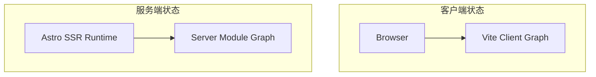

最近在本地开发博客时，遇到了一个极其诡异的现象：每次修改 CSS 后，通过 HMR（热更新）看效果一切正常。但只要手动刷新页面，元素就会出现新旧样式交替的闪烁，甚至触发莫名其妙的 CSS 过渡动画（Transition）。

经过一番排查，发现这并不是我代码的问题，而是 Astro 6 在开发模式（dev 模式）下的一个已知回归缺陷（Regression Bug）。

官方 Issue #16308: Problem in Astro 6: CSS updates during dev server do not fully reset previous style state after reload

剖析根源：Astro 6 的两套状态
要理解这个 Bug 为什么发生，我们需要看看 Astro 6 在底层是如何处理模块图（Module Graph）的。在 dev 模式下，Astro 实际上维护着两套并行的状态：

当我们修改一个组件的样式（例如从 Button.astro 关联的 button.css）时：

Vite Client Graph 会迅速捕捉到变化，并通过客户端 HMR 把新的 CSS 推送到浏览器。所以你在编辑器里一保存，页面立马就变了。

Server Module Graph（服务端渲染运行时） 为了性能优化，避免不必要的全站重载，会故意“跳过”样式模块的转换更新。

这就导致了一个致命的脱节：SSR 里的 cssContentCache 永远卡在了第一次启动时的旧状态。

当你按下 F5 刷新页面时，服务器首先吐出的是带着旧缓存的 HTML 内联 <style>。紧接着，页面底部的 Vite JS 模块加载完成，又把新样式覆盖了上去。这一旧一新的交替，如果恰好碰上了 transition 属性，浏览器就会老老实实地给你播放一段“从旧变新”的幽灵动画。

硬核验证：用终端抓出潜伏的缓存
光看浏览器的表现可能会被各种视觉效果干扰，最稳妥的验证方式是直接用 curl 扒开服务器返回的原始 HTML。以我博客导航栏的文字颜色变量 --nav-link 为例，我们来重现案发现场。

1. 记录初始状态
在终端直接抓取本地开发服务器输出的 CSS 变量：

Bash
$ curl -s http://localhost:4321 | grep -e "--nav-link:"
  --nav-link: #2ea9df;
  --nav-link: var(--foreground);
注： 为什么抓到了两个 --nav-link？因为我的博客支持多主题，前者定义在 :root 中用于浅色模式，后者定义在暗黑模式的作用域下。

2. 触发修改并抓包实锤
回到编辑器，找到浅色模式下的定义，将其随意修改为一个反差极大的颜色，比如红色：

CSS
--nav-link: #ff0000;
保存代码后，浏览器通过 HMR 已经变红了。此时我们不要重启服务，再次在终端运行抓取命令模拟页面刷新：

Bash
$ curl -s http://localhost:4321 | grep -e "--nav-link:"
  --nav-link: #2ea9df;
  --nav-link: var(--foreground);
看！这就是 Bug 的铁证！ 尽管我们在源码里已经改成了红色（#ff0000），但 SSR 服务端返回的 HTML 里，依然死死咬着最初的旧缓存 #2ea9df 不放。

解决方案
官方已经定位到了这个缓存失效的根本原因（isStyleModule 无法正确识别带有 query 参数的 Astro 内联样式，且跳过模块时未清理关联缓存），并合并了修复代码。

如果你不想每次改完 CSS 都去手动重启 pnpm dev 打断心流，可以直接安装官方提供的包含补丁的快照版本作为临时过渡：

Bash
pnpm i https://pkg.pr.new/astro@df6a529
安装完这个补丁包后，再次重复上面的测试，SSR 的缓存就能被正确清理，这个折磨人的“幽灵动画”也就彻底消失了。